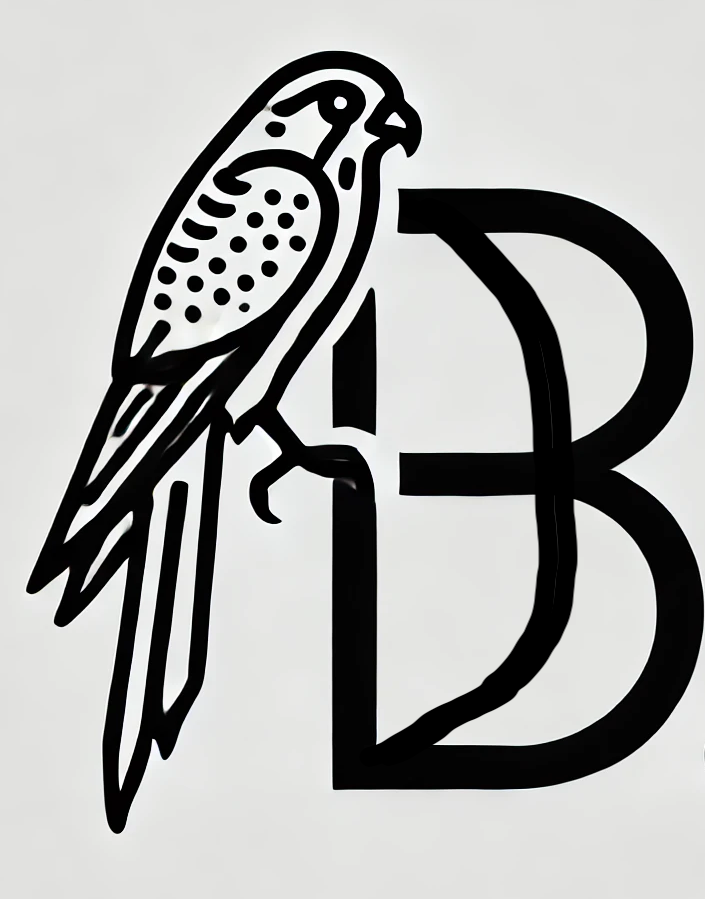

# SparrowDB is now KestrelDB

## Welcome to the KestrelDB project

## What is KestrelDB

This is a sql relational database implemented in rust. Here you will find a from scratch implementation of a RDBMS with a Buffer Pool Manager (like PostgreSQL). You will find a LRU-K implementation of the cache (MRU implementation is under investigation for OLAP) since we do OLTP at present. You will find an MVCC implemention (in-progress), and Query Planner (in-progress). 

FYI: A Kestrel is a bird of prey, that is very fast in flight.

## Blogs

If you are interested in how this project has evolved and how it is envisioned to grow, along with graphics, please see the blogs at  <a href="https://concurrencycorner.blogspot.com/" target="_blank">Concurrency Corner</a>, my personal blog about concurrent systems.

## Contribution

Please feel free to contribute should you desire to.

<h3 align="center" > </h3